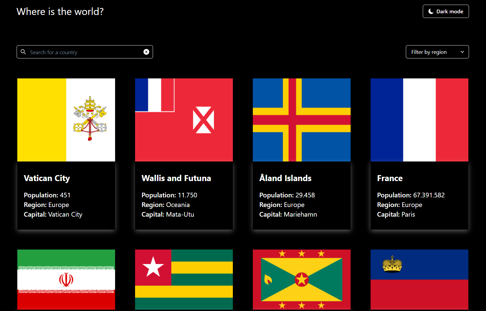

# Countries

**Вы также можете прочитать этот README на [русском](https://github.com/klekwedge/countries/blob/main/README.md)**

## Table of contents

- [Deployment instructions](#deployment-instructions)
- [Overview](#overview)
  - [Screenshot](#screenshot)
  - [Links](#links)
- [My process](#my-process)
  - [Built with](#built-with)
  - [What I learned](#what-i-learned)
- [Author](#author)

## Deployment instructions

**To run the project, you need to have [npm](https://nodejs.org/en/) and [git](https://git-scm.com/downloads) installed on your computer**

1. Make a clone of this repository ```git clone https://github.com/klekwedge/countries.git```
2. Install all required npm packages with ```npm i```
3. Run the project with the command ```npm run dev```

## Overview

Your challenge is integrating with the REST Countries API to pull country data and display it like in the designs.

You can use any JavaScript framework/library on the front-end, such as React or Vue. You also have complete control over which packages you use to make HTTP requests or style your project.

Your users should be able to:

- See all countries from the API on the homepage
- Search for a country using an input field
- Filter countries by region
- Click on a country to see more detailed information on a separate page
- Click through to the border countries on the detail page
- Toggle the color scheme between light and dark mode (optional)

### Screenshot



### Links

- [Solution URL](https://github.com/klekwedge/countries)
- [Live Site URL](https://klekwedge-countries.vercel.app/)

## My process

### Built with

- React
- TypeScript
- React router
- Chakra UI
- SCSS
- Vite

### What I learned

Worked on theme change, improved my app building skills with React and Typescript. Improved the skills of sending a request to the server and receiving a response from it, as well as displaying the received data on the page.

## Author

- [Website](https://klekwedge-cv.vercel.app/)
- [Linkedin](https://www.linkedin.com/in/klekwedge/)
- [Facebook](https://www.facebook.com/klekwedge)

