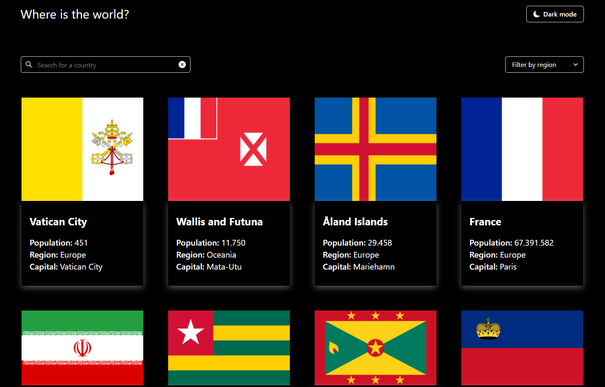

# Countries

**You can also read this README in [English](https://github.com/klekwedge/countries/blob/main/README.EN.md).**

## Оглавление

- [Инструкции по развертыванию](#инструкции-по-развертыванию)
- [Обзор](#обзор)
  - [Скриншот](#скриншот)
  - [Ссылки](#ссылки)
- [Мой процесс](#мой-процесс)
  - [Стек](#стек)
  - [Что я узнал](#что-я-узнал)
- [Автор](#автор)

## Инструкции по развертыванию

**Для запуска проекта на вашем компьютере должны быть установлены [npm](https://nodejs.org/en/) и [git](https://git-scm.com/downloads)**

1. Сделайте клон этого репозитория ```git clone https://github.com/klekwedge/countries.git```
2. Установите все необходимые пакеты npm с помощью ```npm i```
3. Запустите проект командой ```npm run dev```

## Обзор

Ваша задача — интегрироваться с API стран REST, чтобы получать данные о странах и отображать их, как в проектах.

Вы можете использовать любой фреймворк/библиотеку JavaScript во внешнем интерфейсе, например React или Vue. У вас также есть полный контроль над тем, какие пакеты вы используете для выполнения HTTP-запросов или оформления вашего проекта.

Ваши пользователи должны иметь возможность:

- Посмотреть все страны из API на главной странице
- Поиск страны с помощью поля ввода
- Фильтровать страны по регионам
- Нажмите на страну, чтобы увидеть более подробную информацию на отдельной странице
- Перейдите к приграничным странам на странице сведений.
- Переключение цветовой схемы между светлым и темным режимом (необязательно)

### Скриншот



### Ссылки

- [Ссылка на проект](https://github.com/klekwedge/countries)
- [Деплой](https://klekwedge-countries.vercel.app/)

## Мой процесс

### Стек

- React
- TypeScript
- React router
- Chakra UI
- SCSS
- Vite

### Что я узнал

Работал над изменением темы, улучшил свои навыки создания приложений с помощью React и Typescript. Улучшены навыки отправки запроса на сервер и получения от него ответа, а также отображения полученных данных на странице.

## Автор

- [Вебсайт](https://klekwedge-cv.vercel.app/)
- [Linkedin](https://www.linkedin.com/in/klekwedge/)
- [Facebook](https://www.facebook.com/klekwedge)
